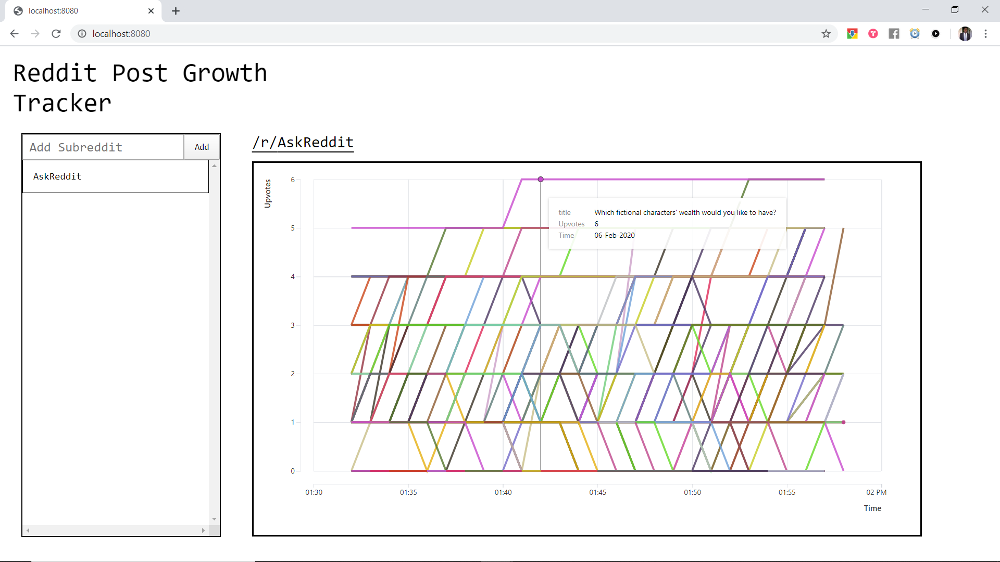

# reddit-post-growth-tracker
Tracks how reddit posts grow over time

#### Objectives
* Add a modal that gets displayed on first visit that explains the sites purpose ina cool non-obtrusive way.
* Add loading functionality.
* Realtime Features Still doesnt work!: Make it work.

#### Post-Objectives
* Modularize DB interactions. I.e, create a query executor,, have it handle errors.
* Add Date-Created to the subscribed_submissions table schema, fill value for each existing entry, update insertion logic to make sure that date-created is specified for each newly entered submission
* Add the functionality so that when making a GET /subreddits request, a start range can be specified. Memoize data on the front end. By asking only for the data we don't have, request fullfiment time is reduced significantly.
* 100 curves of overlapping color on the same graph --> Use more colors, reduce submissions being viewed.
* Add button hover transitions and theme the site

#### Quirks
* Node.js::Express is a better server choice than Python::Fla in my opinion, however, there was no JS reddit module I could find with the feature of being able to get the subreddit id simply, thus I just decided to use a Python Server.  
* subscribe is an ambiguous verb in the context of the because on reddit you 'subscribe' to subreddits.
In the case of this app, subscribe means to add that subreddit to the collection of subreddits whose posts we are tracking the growth of.
* ORM? 🤔
* The detection of new posts can be optimized, using timestamps, e.g.: get all posts created after the last time the detection-subscription procedure was performed. Better: new submissions are streamed to the procedure controller.  
* MVC from now on.

#### Insights
* Process everything on the backend. Front-end is strictly presentational.
